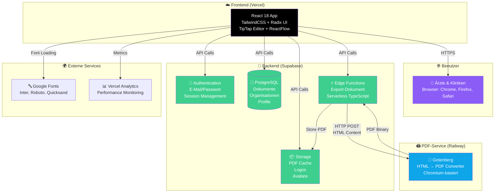

# SOP Editor - Systemarchitektur & Tech-Stack

## Übersicht

Dieses Diagramm zeigt die komplette Systemarchitektur der SOP Editor Anwendung, inklusive aller Services, Verbindungen und Datenflüsse.

---

## Interaktives Diagramm (Mermaid)



---

## Textbasiertes Diagramm (für Präsentationen)

```
┌─────────────────────────────────────────────────────────────────┐
│                    SOP EDITOR - SYSTEMARCHITEKTUR              │
└─────────────────────────────────────────────────────────────────┘

┌─────────────────┐
│   👤 BENUTZER   │  Ärzte & Kliniken
│  (Browser)      │  Chrome, Firefox, Safari, Edge
└────────┬────────┘
         │ HTTPS
         ▼
┌─────────────────────────────────────────────────────────────────┐
│                    FRONTEND (Vercel)                            │
│  ┌──────────────────────────────────────────────────────────┐  │
│  │  React 18 App                                             │  │
│  │  • TailwindCSS (Styling)                                 │  │
│  │  • Radix UI (Komponenten)                                │  │
│  │  • TipTap (Rich-Text Editor)                             │  │
│  │  • ReactFlow (Flowchart-Editor)                          │  │
│  │  • @dnd-kit (Drag & Drop)                                │  │
│  └──────────────────────────────────────────────────────────┘  │
└────────┬───────────────────────────────────────────────────────┘
         │
         │ API Calls (HTTPS)
         │
         ▼
┌─────────────────────────────────────────────────────────────────┐
│                    BACKEND (Supabase)                           │
│  ┌──────────────────────────────────────────────────────────┐  │
│  │  🔑 Authentication                                        │  │
│  │  • E-Mail/Passwort Login                                 │  │
│  │  • Session Management                                     │  │
│  │  • User Profiles                                         │  │
│  └──────────────────────────────────────────────────────────┘  │
│  ┌──────────────────────────────────────────────────────────┐  │
│  │  💾 PostgreSQL Datenbank                                 │  │
│  │  • documents (SOP-Inhalte)                               │  │
│  │  • organizations (Kliniken)                             │  │
│  │  • profiles (Benutzerdaten)                             │  │
│  └──────────────────────────────────────────────────────────┘  │
│  ┌──────────────────────────────────────────────────────────┐  │
│  │  📦 Storage (Supabase Storage)                           │  │
│  │  • PDF Cache (generierte PDFs)                           │  │
│  │  • Logos (Klinik-Logos)                                  │  │
│  │  • Avatare (Benutzerbilder)                              │  │
│  └──────────────────────────────────────────────────────────┘  │
│  ┌──────────────────────────────────────────────────────────┐  │
│  │  ⚡ Edge Functions (Serverless)                          │  │
│  │  • export-document (PDF/Word Generierung)               │  │
│  │  • TypeScript/Deno Runtime                              │  │
│  └──────────────────────────────────────────────────────────┘  │
└────────┬───────────────────────────────────────────────────────┘
         │
         │ HTTP POST (HTML Content)
         │
         ▼
┌─────────────────────────────────────────────────────────────────┐
│              PDF-SERVICE (Railway)                              │
│  ┌──────────────────────────────────────────────────────────┐  │
│  │  📄 Gotenberg                                            │  │
│  │  • HTML → PDF Converter                                 │  │
│  │  • Chromium-basiert (konsistente Rendering)              │  │
│  │  • Docker Container                                      │  │
│  │  • REST API                                              │  │
│  └──────────────────────────────────────────────────────────┘  │
└─────────────────────────────────────────────────────────────────┘
         │
         │ PDF Binary
         │
         ▼
┌─────────────────────────────────────────────────────────────────┐
│                    EXTERNE SERVICES                             │
│  ┌──────────────────────────────────────────────────────────┐  │
│  │  🔤 Google Fonts                                          │  │
│  │  • Inter, Roboto, Quicksand                              │  │
│  └──────────────────────────────────────────────────────────┘  │
│  ┌──────────────────────────────────────────────────────────┐  │
│  │  📊 Vercel Analytics                                     │  │
│  │  • Performance Monitoring                               │  │
│  │  • Usage Statistics                                     │  │
│  └──────────────────────────────────────────────────────────┘  │
└─────────────────────────────────────────────────────────────────┘
```

---

## Datenfluss: PDF-Export

```
1. Benutzer klickt "PDF exportieren"
   │
   ▼
2. Frontend serialisiert Editor-Inhalt zu HTML
   │
   ▼
3. Frontend sendet HTML an Supabase Edge Function
   │
   ▼
4. Edge Function prüft Cache (Supabase Storage)
   │
   ├─ Cache HIT → PDF direkt aus Storage zurückgeben
   │
   └─ Cache MISS → Weiter zu Schritt 5
      │
      ▼
5. Edge Function sendet HTML an Gotenberg (Railway)
   │
   ▼
6. Gotenberg konvertiert HTML zu PDF (Chromium)
   │
   ▼
7. PDF zurück an Edge Function
   │
   ▼
8. Edge Function speichert PDF in Storage (Cache)
   │
   ▼
9. PDF an Frontend zurückgeben
   │
   ▼
10. Frontend startet Download
```

---

## Tech-Stack Übersicht

### Frontend
| Service | Technologie | Zweck |
|---------|------------|-------|
| **Hosting** | Vercel | React App Deployment |
| **Framework** | React 18 | UI Framework |
| **Styling** | TailwindCSS | Utility-First CSS |
| **UI Components** | Radix UI | Accessible Components |
| **Editor** | TipTap 3 | Rich-Text Editor |
| **Flowcharts** | ReactFlow 11 | Algorithmus-Editor |
| **Drag & Drop** | @dnd-kit | Block-Verschiebung |

### Backend
| Service | Technologie | Zweck |
|---------|------------|-------|
| **BaaS** | Supabase | Backend-as-a-Service |
| **Datenbank** | PostgreSQL | Dokumente, User, Organisationen |
| **Auth** | Supabase Auth | Benutzer-Authentifizierung |
| **Storage** | Supabase Storage | PDF Cache, Logos, Avatare |
| **Functions** | Supabase Edge Functions | Serverless TypeScript |

### PDF-Generierung
| Service | Technologie | Zweck |
|---------|------------|-------|
| **Hosting** | Railway | Cloud-Server |
| **Service** | Gotenberg | HTML → PDF Converter |
| **Runtime** | Docker | Container-Umgebung |
| **Browser** | Chromium | Konsistentes Rendering |

### Externe Services
| Service | Zweck |
|---------|-------|
| **Google Fonts** | Schriftarten (Inter, Roboto, Quicksand) |
| **Vercel Analytics** | Performance & Usage Monitoring |

---

## Kostenübersicht (monatlich)

| Service | Kosten | Nutzung |
|---------|--------|---------|
| **Vercel** | $0-20 | Frontend Hosting (Free Tier bis Pro) |
| **Supabase** | $0-25 | Backend, DB, Storage (Free Tier bis Pro) |
| **Railway** | $5-10 | Gotenberg Server |
| **Google Fonts** | $0 | Kostenlos |
| **Vercel Analytics** | $0 | Kostenlos (im Pro Plan) |
| **GESAMT** | **$5-55/Monat** | Je nach Nutzung |

---

## Sicherheit & Skalierbarkeit

### Sicherheit
- ✅ HTTPS für alle Verbindungen
- ✅ Row Level Security (RLS) in Supabase
- ✅ Authentifizierung via Supabase Auth
- ✅ API Keys in Environment Variables
- ✅ CORS-Schutz für alle Services

### Skalierbarkeit
- ✅ Serverless Functions (automatische Skalierung)
- ✅ CDN für Frontend (Vercel)
- ✅ Horizontale Skalierung von Gotenberg möglich
- ✅ Caching reduziert Server-Last um ~90%
- ✅ Database Indexing für Performance

---

## Wartung & Monitoring

### Monitoring
- **Vercel Analytics**: Frontend Performance
- **Supabase Dashboard**: Database & API Metrics
- **Railway Dashboard**: Server Status & Logs

### Wartung
- **Automatische Updates**: Vercel & Supabase
- **Manuelle Updates**: Gotenberg (Railway)
- **Backups**: Supabase automatisch
- **Logs**: Alle Services bieten Logging

---

*Letzte Aktualisierung: 2025-01-29*

